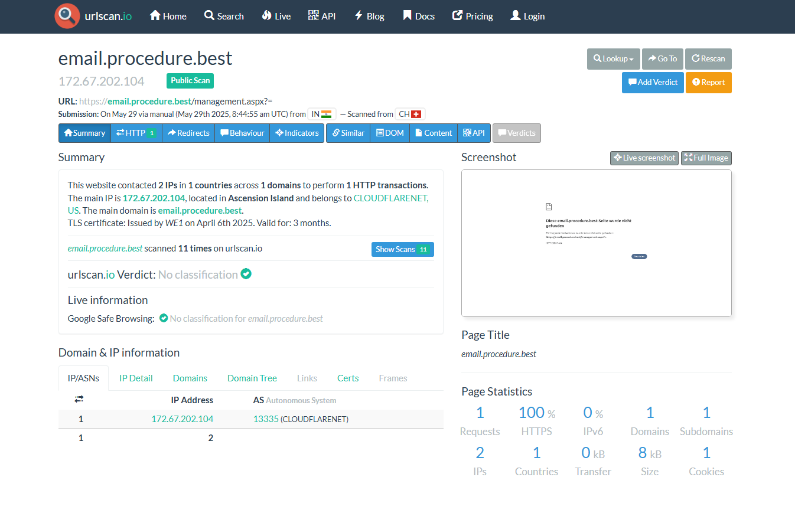

# Infrastructure Analysis

## WHOIS Lookup

The root domain **procedure[.]best** was analyzed using VirusTotal WHOIS data.

### Domain Registration Details

- Creation Date: August 13, 2024  
- Registrar: Sav.com, LLC  
- Expiration Date: August 13, 2026  
- Registrant Country: United States  
- Name Servers:
  - NS1-EXPIRED.SAV.COM
  - NS2-EXPIRED.SAV.COM
    
---

---

## WHOIS Assessment

- The domain is relatively new (approximately 6 months old)
- Registrant details appear anonymized or system-generated
- No legitimate organization is associated with the domain
- Registrar (Sav.com) is a low-cost domain provider commonly observed in malicious infrastructure
- Name server configuration indicates basic or low-reputation hosting infrastructure

**Conclusion:** Domain characteristics are consistent with infrastructure used for phishing operations.

--- 

## URLScan Analysis

The phishing URL was analyzed using URLScan to identify hosting infrastructure and network details.

### Hosting Details

- Domain: email.procedure[.]best
- URL: hxxps://email.procedure[.]best/management.aspx
- IP Address: 172.67.202.104
- ASN: AS13335
- Hosting Provider: Cloudflare, Inc.
- Location: Ascension Island
- HTTPS: Enabled
- TLS Certificate: Recently issued

---

## URLScan Assessment

- The domain is hosted behind Cloudflare, a content delivery network commonly used to obscure origin infrastructure
- Use of Cloudflare can make attribution and takedown efforts more difficult
- The page content appears minimal or inactive at the time of analysis, indicating the phishing site may have been removed or disabled
- Multiple historical scans indicate prior activity associated with the domain

**Conclusion:** Infrastructure is consistent with phishing operations using CDN protection to conceal backend hosting.
