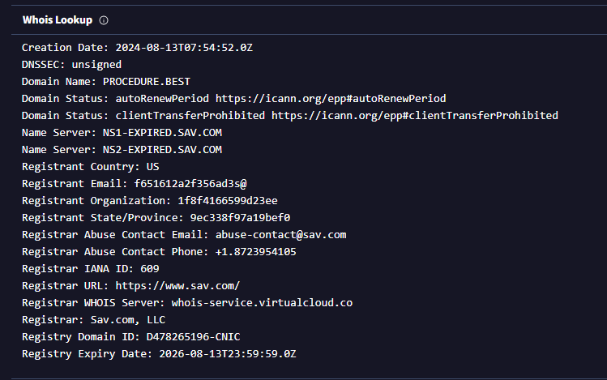

# Infrastructure Analysis

## WHOIS Lookup

The root domain **procedure[.]best** was analyzed using VirusTotal WHOIS data.

### Domain Registration Details

- Creation Date: August 13, 2024  
- Registrar: Sav.com, LLC  
- Expiration Date: August 13, 2026  
- Registrant Country: United States  
- Name Servers:
  - NS1-EXPIRED.SAV.COM
  - NS2-EXPIRED.SAV.COM
    
---

---

## WHOIS Assessment

- The domain is relatively new (approximately 6 months old)
- Registrant details appear anonymized or system-generated
- No legitimate organization is associated with the domain
- Registrar (Sav.com) is a low-cost domain provider commonly observed in malicious infrastructure
- Name server configuration indicates basic or low-reputation hosting infrastructure

**Conclusion:** Domain characteristics are consistent with infrastructure used for phishing operations.
