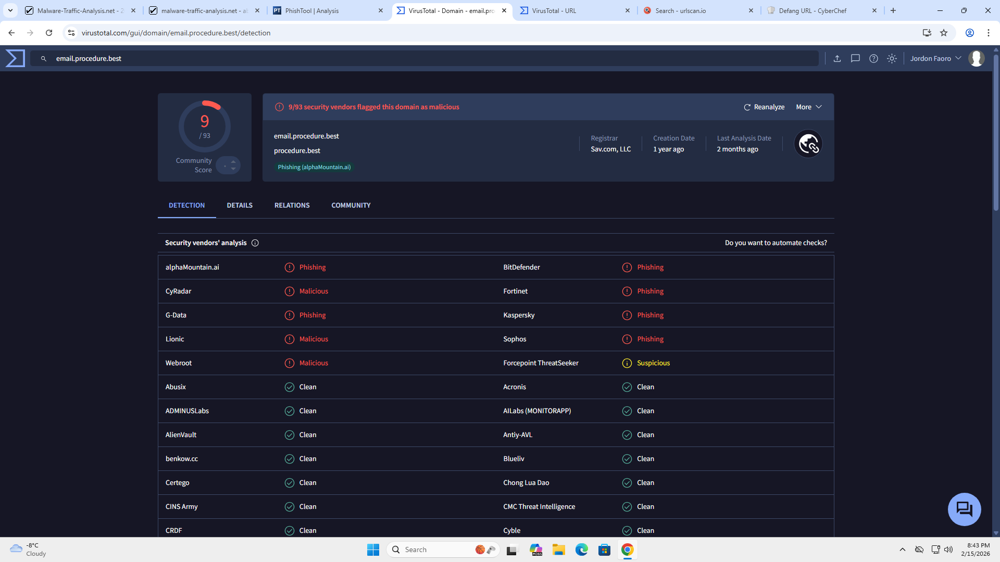
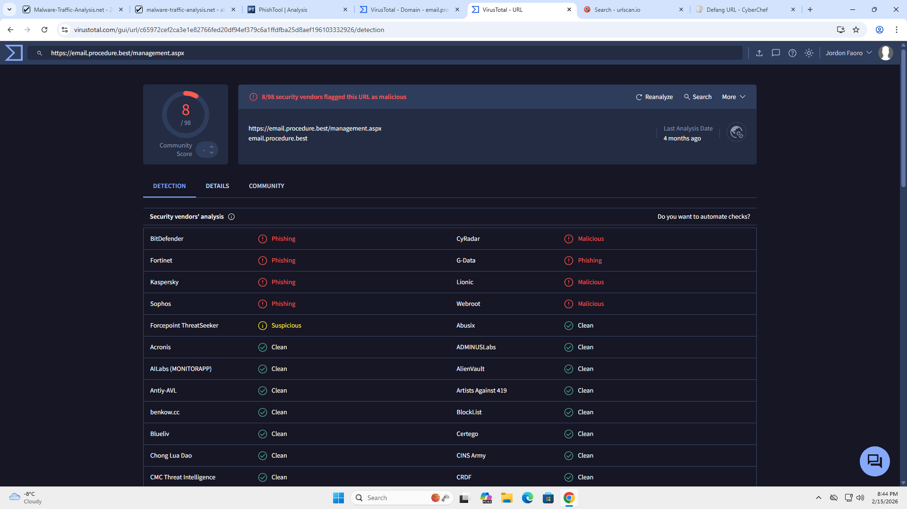

# URL & Domain Investigation

The phishing email contained a link directing the user to an external website. The domain and full URL were analyzed using VirusTotal to determine reputation and potential malicious activity.

---

## Investigated Artifacts

| Type | Value |
|------|------|
| Domain | email.procedure[.]best |
| URL | hxxps://email.procedure[.]best/management.aspx |

---

## Domain Reputation (VirusTotal)

- Detection: **9 / 93 security vendors flagged as malicious**
- Classification: Phishing / Malicious
- Registrar: Sav.com, LLC
- Domain Age: Approximately 1 year
- Last Analysis: 2 months ago

Several security vendors identified the domain as hosting phishing content.

### Key Vendor Classifications
- BitDefender: Phishing
- Fortinet: Phishing
- Kaspersky: Phishing
- Sophos: Phishing
- CyRadar: Malicious
- Lionic: Malicious

**Conclusion:** The domain has an established malicious reputation associated with phishing activity.

Screenshot:

---

## URL Reputation (VirusTotal)

- Detection: **8 / 98 security vendors flagged as malicious**
- Classification: Phishing / Malicious
- Last Analysis: 4 months ago

The specific URL path used in the email is also recognized by multiple vendors as malicious.

### Key Vendor Classifications
- BitDefender: Phishing
- Fortinet: Phishing
- Kaspersky: Phishing
- Sophos: Phishing
- CyRadar: Malicious
- Lionic: Malicious

**Conclusion:** The full URL is confirmed to be part of a phishing infrastructure and should be blocked.

Screenshot:

---

## Risk Interpretation

Although the domain is not newly registered, multiple independent security vendors identify both the domain and the specific URL as malicious. This indicates the infrastructure has been used for phishing campaigns and poses a high risk if accessed by users.

---

## Overall Assessment

The domain and URL are confirmed malicious based on multi-vendor threat intelligence and are consistent with credential harvesting activity observed in the phishing email.

